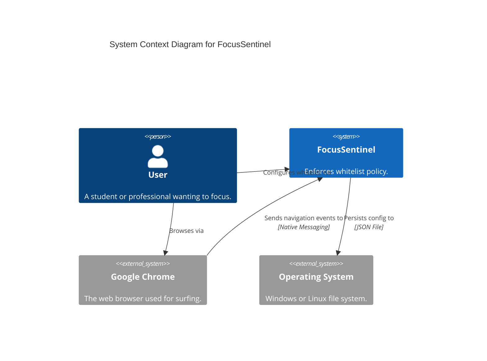
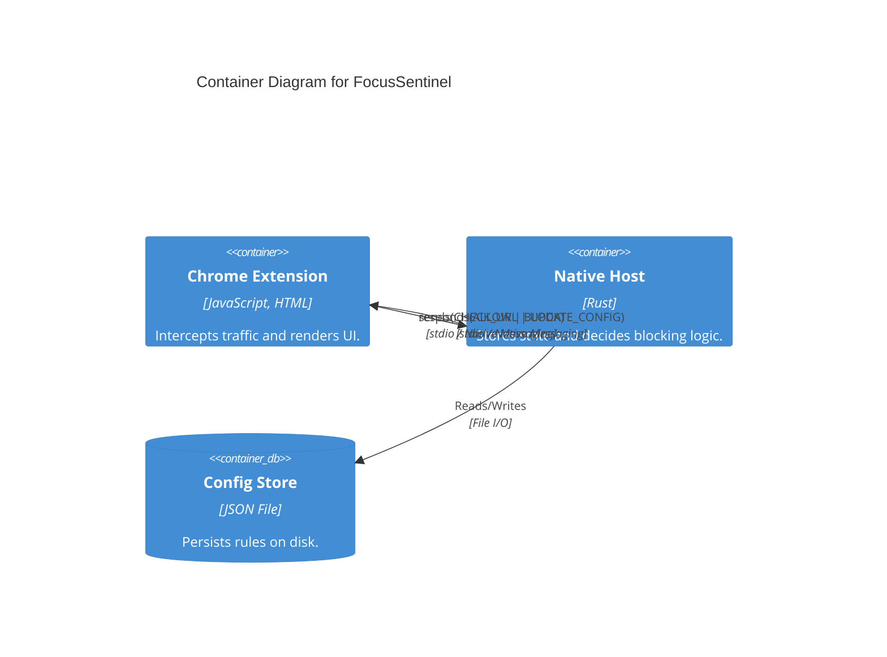

# Architecture Overview

## 1. High-Level Overview

**FocusSentinel** is a cross-platform application designed to enforce strict study habits by blocking distracting websites. It operates on a "deny-by-default" principle (whitelist only) when active.

The system addresses the limitation of pure browser extensions, which can be easily circumvented or lack system-level persistence, by offloading the core logic and configuration state to a **Native Messaging Host**.

### Problems Solved
- **Circumvention:** Pure extensions can be easily disabled or removed. By coupling with a native host, we establish a stronger persistence layer (though ultimately, the user has admin rights).
- **State Persistence:** Configuration is stored on the OS file system, independent of the browser's storage clearing.
- **Cross-Platform Compatibility:** A single codebase supports both Windows and Linux through conditional compilation and standard communication protocols.

## 2. System Context (C4 Model)

FocusSentinel fits into the user's desktop environment as a bridge between the Web Browser and the Operating System.

## 3. Container Architecture

The system is composed of two primary containers:

1.  **Chrome Extension (Frontend):**
    *   **Responsibility:** Intercepting user navigation, providing configuration UI, and visualizing block status.
    *   **Technology:** HTML, CSS, JavaScript (Manifest V3).
    *   **Key Components:** `background.js` (Service Worker), `popup.html` (UI).

2.  **Native Host (Backend):**
    *   **Responsibility:** Storing the "source of truth" (whitelist), evaluating URLs against the policy, and enforcing persistence.
    *   **Technology:** Rust.
    *   **Key Components:** JSON I/O Loop, Config Manager, URL Matcher.

