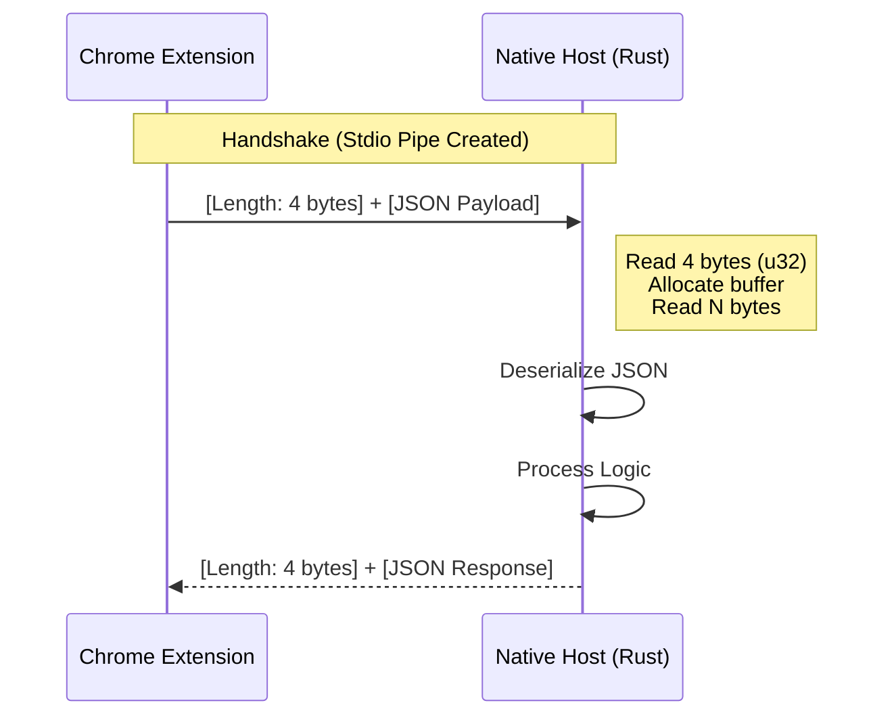
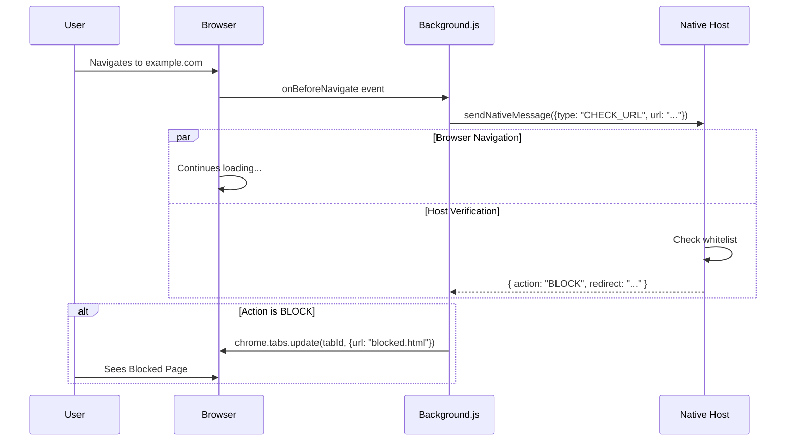

# Data Flow & Communication Protocol

## 1. Protocol Overview

Communication between the Chrome Extension and the Rust Native Host occurs over **Standard I/O (stdio)** using the **Chrome Native Messaging** protocol.

### Message Format
Each message is a JSON object preceded by a 4-byte length header in **native byte order** (Little Endian on both Windows/Linux x86_64).

1.  **Length Header (4 bytes):** Unsigned 32-bit integer specifying the JSON byte length.
2.  **Payload (N bytes):** UTF-8 encoded JSON string.



## 2. JSON Schema

### Requests (Extension -> Host)

The host accepts a discriminated union of request types.

#### Type 1: `UPDATE_CONFIG`
Updates the persisted configuration on the host.

```json
{
  "type": "UPDATE_CONFIG",
  "payload": {
    "is_active": true,
    "whitelist": ["google.com", "github.com"]
  }
}
```

#### Type 2: `CHECK_URL`
Asks the host to validate a URL against the current whitelist.

```json
{
  "type": "CHECK_URL",
  "url": "https://www.facebook.com/feed"
}
```

### Responses (Host -> Extension)

#### Type 1: Acknowledge
Sent after a successful config update.

```json
{
  "status": "ok"
}
```

#### Type 2: Check Result
Sent after evaluating a URL.

**Allowed:**
```json
{
  "action": "ALLOW"
}
```

**Blocked:**
```json
{
  "action": "BLOCK",
  "redirect": "blocked.html"
}
```

## 3. Asynchronous Data Flow

Since the Native Messaging API key components interaction is asynchronous, the extension maintains a state of pending validations (conceptually, though currently implemented as fire-and-forget with ordered responses).


