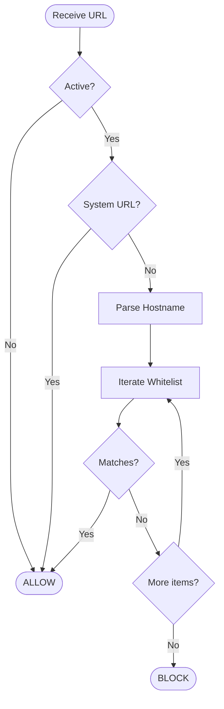

# Core Logic & Rust Implementation

## 1. Project Structure

The `host/` directory contains the Rust source code.

```text
host/
├── Cargo.toml      # Dependencies: serde, byteorder, dirs
├── src/
│   └── main.rs     # Single-file implementation
└── com.focussentinel.json # Native Messaging Manifest
```

## 2. Configuration Management

Configuration is stored in a JSON file located in the user's configuration directory. We use the `dirs` crate to resolve these paths cross-platform.

| OS | Path |
| :--- | :--- |
| **Windows** | `%APPDATA%\FocusSentinel\config.json` |
| **Linux** | `~/.config/focussentinel/config.json` |

### Logic
1.  **Load:** On startup and before every request, the host *could* reload config, but currently, it reloads `LoadConfig` inside the loop to ensure fresh state if modified externally (though `main` logic currently re-reads mainly for robustness). *Correction: The implementation loads checks config on every request to ensure statelessness regarding the process lifecycle.*
2.  **Save:** When `UPDATE_CONFIG` is received, the file is overwritten atomically (via `fs::write`).

## 3. URL Matching Algorithm

The core validation logic resides in the `check_url` function.

**Algorithm:**
1.  **Input:** `url_str` (String)
2.  **Pre-check:** If `is_active` is `false` -> **ALLOW**.
3.  **Sanity Check:** If URL starts with `chrome://` or `chrome-extension://` -> **ALLOW** (Prevent self-blocking).
4.  **Parse:** Use `url` crate to extract the `host` (domain).
5.  **Whitelist Scan:** Iterate through `whitelist` vector.
    *   Check 1: Exact match (`host == allowed_domain`)
    *   Check 2: Suffix match with dot (`host.ends_with(".allowed_domain")`)
        *   *Example:* `mail.google.com` matches `.google.com`.
6.  **Result:**
    *   Match found -> **ALLOW**.
    *   No match -> **BLOCK**.



## 4. Error Handling

*   **I/O Errors:** If reading from `stdin` fails (e.g., unexpected EOF), the host assumes the Chrome pipe is closed and terminates gracefully.
*   **Parsing Errors:** Malformed JSON results in a termination or error log (currently simple panic/unwrap in some places for brevity, but `main` loop handles `Result`).
