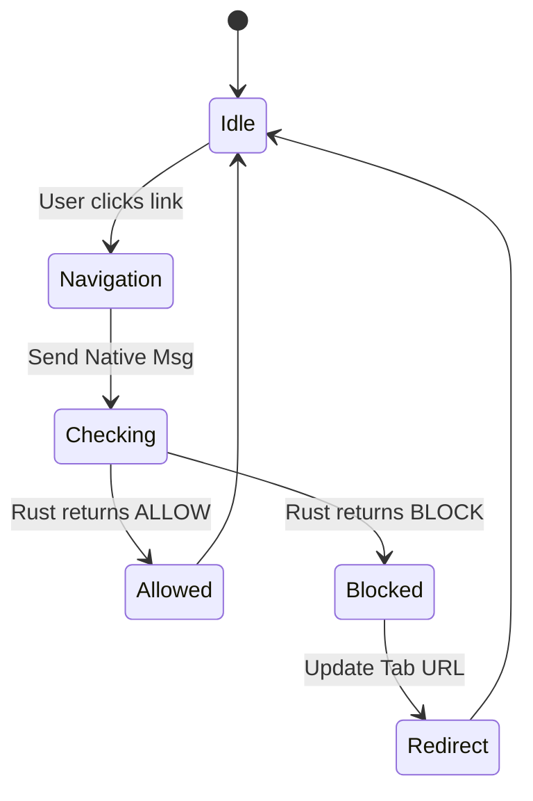

# Chrome Extension Implementation

## 1. Manifest V3 Architecture

The extension is built on **Manifest V3**, which replaces persistent background pages with ephemeral **Service Workers**.

### Key Constraints & Solutions
*   **Constraint:** Service Workers die after inactivity.
*   **Solution:** We reconnect to the Native Host (`connectToNative`) whenever the Service Worker wakes up or detects a disconnection.

### Permissions
*   `nativeMessaging`: Required to talk to the Rust host.
*   `webNavigation`: Used to detect navigation events (`onBeforeNavigate`) efficiently.
*   `tabs`: Used to redirect tabs to the block page.
*   `<all_urls>`: Required to intercept navigation on *any* domain.

## 2. Components

### Background Worker (`background.js`)
*   **Lifecycle:** Event-driven.
*   **Events Monitored:**
    *   `chrome.webNavigation.onBeforeNavigate`: Triggered when the user presses Enter or clicks a link.
    *   `port.onMessage`: Triggered when Rust replies.
    *   `port.onDisconnect`: Triggered if the Rust process crashes or is killed.

### Popup UI (`popup.html` / `popup.js`)
*   **Tech:** Vanilla JS, CSS Variables for theming.
*   **State Sync:**
    *   The Popup *cannot* directly access the Rust host state synchronously.
    *   It uses `chrome.storage.local` as a cache/proxy for the current state (`is_active`, `whitelist`).
    *   On change, it saves to `storage` AND sends `UPDATE_CONFIG` to Rust.

### Block Page (`blocked.html`)
*   **Design:** Simple, dark-themed, motivational.
*   **Behavior:** Local HTML resource. This ensures it works even if the user is offline.

## 3. Navigation Blocking Flow

Unlike `declarativeNetRequest` (which is static), our requirements (OS-level whitelist) demand dynamic checking.

1.  User visits `youtube.com`.
2.  `onBeforeNavigate` fires.
3.  Extension sends `{ type: "CHECK_URL", url: "..." }` to Rust.
4.  Rust checks JSON config.
5.  **If Blocked:**
    *   Rust sends `{ action: "BLOCK", redirect: "blocked.html" }`.
    *   Extension executes `chrome.tabs.update(tabId, { url: "blocked.html" })`.
    *   User sees the blocked page replacing the target content.

